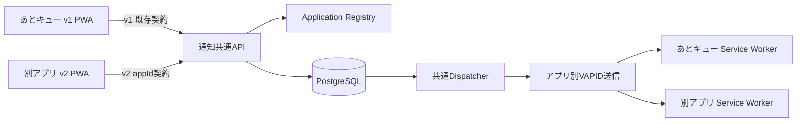

# 通知共通基盤 v2 基本設計

- 設計日: 2026-09-09
- 状態: 承認済み
- 対象要件: `F-013`、`F-014`、`F-015`、`F-019`、`NF-004`〜`NF-007`、`NF-012`〜`NF-014`
- 前提: 共通基盤を利用するのは管理者本人が管理するブラウザアプリに限る

## 1. 目的

あとキューで実績のある匿名Web Pushの登録、予約、取消、冪等再送、期限到来配送を、管理者が今後開発する別アプリでも再利用できるようにする。

あとキューの通知安定性を最優先とし、稼働中の`v1`通信契約、既存Push購読、Service Worker payloadを維持したまま、アプリ名前空間を持つ`v2`を並行追加する。

## 2. 設計原則

1. `v1`を破壊しない。あとキューの既存フロントエンドは当面`v1`を使い続ける。
2. 新規アプリは`v2`だけを使う。
3. 通知バックエンドへ本文、タイトル、タスクID、カテゴリなどの私的内容を送らない。
4. 各アプリは独自のPush購読、端末資格情報、VAPID鍵、Service Workerを持つ。
5. 時刻計算と業務状態は各アプリの端末内に置き、共通基盤は匿名予約の配送に限定する。
6. 任意URLをPush payloadへ含めず、アプリ内の`routeKey`をService Workerが安全な相対URLへ解決する。
7. 既存予約の時刻変更は同じ`reminderId`への`PUT`で行い、通信再試行は同じ`Idempotency-Key`を使う。

## 3. スコープ

### 3.1 対象

- 設定管理された複数アプリの`appId`分離
- アプリ別オリジン検証とCORS許可
- アプリ別VAPID鍵
- `v2`端末登録、購読更新、端末無効化
- `v2`匿名通知予約、更新、取消
- `v1`と`v2`を同じDispatcher、再試行、失効処理で配送
- 別アプリ向けTypeScriptクライアントとService Worker補助関数
- 既存DB行の後方互換移行
- アプリ別の匿名運用ログとレート制限

### 3.2 対象外

- 第三者向けセルフサービス登録
- 管理画面、利用者アカウント、課金、アプリ別APIキー発行
- タスクやメモのサーバー保存
- 通知本文や任意URLのサーバー指定
- 通知の正確な時刻保証
- あとキューフロントエンドの`v2`移行

## 4. 採用方式

### 4.1 APIバージョン

- `v1`: 既存あとキュー専用。URL、request、response、Push payloadを維持する。
- `v2`: `appId`をURL名前空間へ登録として持つ共通契約。
- 内部サービスは共通化するが、`v1` Adapterが`appId=atoqueue`、`protocolVersion=1`を補完する。

`v1`を直接変更する案は、更新前Service Workerやキャッシュ済みPWAを壊すため採用しない。アプリごとにAPIを複製する案は、運用と不具合修正が分岐するため採用しない。

### 4.2 全体構成



## 5. Application Registry

管理者がサーバー設定として次を登録する。ブラウザへ秘密値は配布しない。

```ts
interface NotificationApplicationConfig {
  appId: string;                        // ^[a-z][a-z0-9-]{0,31}$
  origins: string[];                    // HTTPS。localhostは開発時のみ
  vapidPublicKey: string;
  vapidPrivateKey: string;
  vapidSubject: `mailto:${string}`;
  notificationKeys: string[];           // ^[a-z][a-z0-9_]{0,63}$
  routeKeys: string[];                  // ^[a-z][a-z0-9_]{0,63}$
}
```

- `appId`は永続的で、表示名変更でも変えない。
- `appId=atoqueue`は予約済みとする。
- 新しいアプリ追加はRegistry設定と別アプリ実装だけで行い、API契約やDBスキーマを変えない。
- アプリ別VAPID鍵を使い、別アプリの鍵変更や障害をあとキューへ波及させない。
- Registry設定は起動時に厳密検証し、重複`appId`、重複Origin、不正キーがあればAPIを起動しない。

## 6. v2通信契約

別アプリへ渡す完全な通信仕様は[通知共通基盤 v2 連携仕様・実装ガイド](notification-platform-v2.md)を正とする。

### 6.1 エンドポイント

| Method | Path | 認証 | 冪等キー |
| --- | --- | --- | --- |
| `GET` | `/v2/apps/:appId/push/public-key` | 不要 | 不要 |
| `POST` | `/v2/apps/:appId/devices` | 不要 | 不要 |
| `PUT` | `/v2/apps/:appId/devices/:deviceId/subscription` | Bearer | 必須 |
| `DELETE` | `/v2/apps/:appId/devices/:deviceId` | Bearer | 必須 |
| `PUT` | `/v2/apps/:appId/reminders/:reminderId` | Bearer | 必須 |
| `DELETE` | `/v2/apps/:appId/reminders/:reminderId?deviceId=:deviceId` | Bearer | 不要 |

全request/responseはstrict schemaで検証する。`appId`はpathだけに置き、bodyとの二重指定を避ける。

### 6.2 v2予約要求

```json
{
  "deviceId": "a1f0f85e-8da5-4bfb-8fc4-938067ca9984",
  "scheduledAt": "2026-09-10T03:00:00.000Z",
  "notificationKey": "review_due",
  "routeKey": "review",
  "repeatCadence": "daily"
}
```

- `repeatCadence`は省略可能で、許可値は`daily`、`weekly`、`monthly`。
- `scheduledAt`は`Z`で終わるISO 8601 UTC。
- `notificationKey`と`routeKey`はRegistryのアプリ別許可リストに存在しなければならない。
- `title`、`body`、`url`、業務データの識別子と本文は拒否する。

### 6.3 v2 Push payload

```json
{
  "version": 2,
  "appId": "sample-app",
  "type": "reminder_due",
  "reminderId": "a1f0f85e-8da5-4bfb-8fc4-938067ca9984",
  "notificationKey": "review_due",
  "routeKey": "review",
  "groupId": "0123456789abcdef"
}
```

- `groupId`は`appId + NUL + notificationKey + NUL + scheduledAt`のSHA-256先頭16桁とする。
- Service Workerは`version`、`appId`、全キー、UUID形式を検証する。
- `notificationKey`を固定の汎用文へ、`routeKey`を同一オリジンの固定相対パスへ変換する。
- payloadが不正な場合も私的情報は表示せず、各アプリが決めた安全な既定画面を開く。

## 7. フロントエンド責務

共通クライアントはHTTPとpayload検証だけを担当し、各アプリは次を実装する。

1. 利用者操作を起点とする通知許可要求
2. Service Worker登録とPush購読
3. `deviceId`、`deviceSecret`、登録日時の端末内保存
4. 業務状態と端末時刻からの通知予定計算
5. Outboxへの予約・取消操作の先行保存
6. Outboxの非同期同期、再試行、`Retry-After`尊重
7. 起動時・オンライン復帰時の購読状態検査と不足予約の補完
8. `reminderId`と端末内業務データの対応表
9. Service Worker内の通知文・遷移先allowlist

業務データ保存と通知同期を分離し、API失敗で利用者の入力や状態変更を取り消さない。

## 8. バックエンド責務

- `appId`存在確認とOrigin照合
- アプリ別VAPID公開鍵の返却
- 匿名端末登録とArgon2idによる端末シークレット検証
- 端末がpathの`appId`に所属することの確認
- アプリ別`notificationKey`、`routeKey`の検証
- 匿名予約のupsert、取消、冪等再送
- 期限到来予約の排他的claim、配送、再試行、失効購読の無効化
- アプリ別VAPID資格情報によるPush送信
- 私的内容を含まないアプリ別メトリクスとログ

別アプリが同じ`deviceId`や`deviceSecret`を流用することは禁止する。アプリ不一致は所有情報を漏らさないよう404として扱う。

## 9. データモデルと移行

### 9.1 `device_subscriptions`

次の列を後方互換migrationで追加する。

| 列 | 型 | 既存行 | 用途 |
| --- | --- | --- | --- |
| `app_id` | `TEXT NOT NULL` | `atoqueue` | 購読のアプリ所有境界 |
| `protocol_version` | `INTEGER NOT NULL` | `1` | Dispatcherのpayload選択 |

`device_id`と`endpoint`は引き続きDB全体で一意とする。UUIDを全アプリ共通の不透明IDとして使うため、アプリ別採番は不要である。

### 9.2 `reminder_jobs`

- `notification_type`は物理列名を維持し、`v2`では`notificationKey`を保存する。
- `route_key TEXT NULL`を追加する。既存`v1`行は`NULL`でよい。
- `v2`予約ではService層が`route_key`必須を保証する。
- 予約のアプリ所属は`device_id`から一意に決まるため、重複する`app_id`列は持たない。

### 9.3 移行安全性

- migrationは列追加とindex追加だけとし、既存列の削除・変更を行わない。
- 既存行へ`app_id=atoqueue`、`protocol_version=1`をdefaultで設定する。
- 新コードのrollback後も旧コードが追加列を無視して動作できる。
- `v1` request/response/payloadの契約テストを変更せず回帰ゲートとして残す。

## 10. CORS・認証・分離

- CORSはrouteごとに判定し、`v1`には従来どおりあとキューOriginだけを返す。
- `v2`にはURL上の`appId`とRegistryで対応付けたOriginだけを返し、各requestでも同じ組合せを検証する。
- 未登録`appId`は404、登録済みアプリへの不許可Originは403とする。
- 端末登録はブラウザから安全に保持できるアプリ共通秘密がないため、Origin検証と既存のIP・endpointレート制限で保護する。
- 端末登録後は`deviceSecret`によるBearer認証を必須とし、サーバーはハッシュだけを保持する。
- rate limitと運用集計のキーへ`appId`を含め、あるアプリの集中アクセスを別アプリの枠へ混在させない。

## 11. 配送・障害処理

- 既存の排他的claim上限100件、stale claim回復、5分・15分・60分の再試行、最終failed化を共通利用する。
- Pushサービスの404/410では当該端末を無効化し、同端末のpending予約をfailedにする。
- 繰り返し予約は予定時刻を基準に次回を計算し、遅延配送時刻を起点にずらさない。
- `v1`は既存`review_due + url` payloadを生成する。
- `v2`は`reminder_due + notificationKey + routeKey` payloadを生成する。
- あるアプリのRegistryまたはVAPID設定不備は、そのアプリの予約だけをfailedまたはretry対象とし、Dispatcher全体を停止しない。

## 12. 実装境界

### 12.1 変更する既存領域

- `packages/contracts`: v2 strict schema
- `apps/api/src/config.ts`: Application Registryの検証
- `apps/api/src/plugins/security.ts`: 複数Originとアプリ別rate limit
- `apps/api/src/devices`: app所属とprotocolVersion
- `apps/api/src/reminders`: v2キーとapp所属検証
- `apps/api/src/scheduler`: protocol別payload、アプリ別Push送信
- `apps/api/src/db/migrations`: 後方互換列追加
- `docs/requirements.md`、`docs/api-design.md`、`docs/data-model.md`、運用手順

### 12.2 新規領域

- `packages/notification-client`: v2 HTTPクライアント、payload parser、Service Worker向け純粋関数
- `apps/api/src/applications`: Registryとアプリ設定解決
- `apps/api/src/v2`: v2 route adapter

あとキューの`apps/web`通知実装は変更対象にしない。

## 13. テスト境界

TDDでは次の公開境界をテストする。

1. **契約境界**: v2の正常例を受理し、本文・任意URL・未知フィールドを拒否する。
2. **API境界**: appとOriginの一致、端末認証、app間の端末・予約分離、status code、冪等性。
3. **DB migration境界**: 既存行が`atoqueue/v1`へ移行し、v2行を保存・取得できる。
4. **配送境界**: v1 payloadが一切変わらず、v2だけが新payloadとアプリ別VAPIDを使う。
5. **クライアント境界**: HTTP request生成、エラー分類、payload検証、keyから安全な表示・遷移への解決。
6. **既存回帰境界**: 現行単体・結合・E2E・型検査・buildを全実行する。

内部private methodやSQL実装詳細ではなく、契約・API・migration・配送結果を観測する。

## 14. リリース順

1. 仕様と契約テストを確定する。
2. 後方互換DB migrationを適用可能にする。
3. Registryとv2 APIを実装する。
4. protocol別Dispatcherとアプリ別VAPID送信を実装する。
5. 共通クライアントと別アプリ向け資料を完成させる。
6. 全品質ゲートでv1不変を確認する。
7. APIだけを先行配置し、あとキューv1の配送を監視する。
8. 安定確認後、新規アプリをRegistryへ追加してv2を利用開始する。

## 15. ロールバック

- v2 routeは設定で無効化できるようにする。
- v2を無効化してもv1 routeと既存Dispatcher配送は継続する。
- DB追加列は残し、破壊的down migrationを行わない。
- VAPID鍵はアプリ単位で切り替え、あとキューの既存鍵を変更しない。

## 16. 別アプリへ渡す成果物

別アプリの開発担当には、次の順で渡す。

1. **必須**: `docs/integration/notification-platform-v2.md`
2. **実装後に必須**: `packages/notification-client`のREADMEと配布物
3. **必要時のみ**: 本設計書。共通基盤バックエンドの運用・変更も担当する場合に渡す
4. **調査背景が必要な場合のみ**: `docs/research/2026-09-09-notification-reuse.md`

別アプリへ`deviceSecret`、VAPID private key、本番DB情報を資料として渡してはならない。
